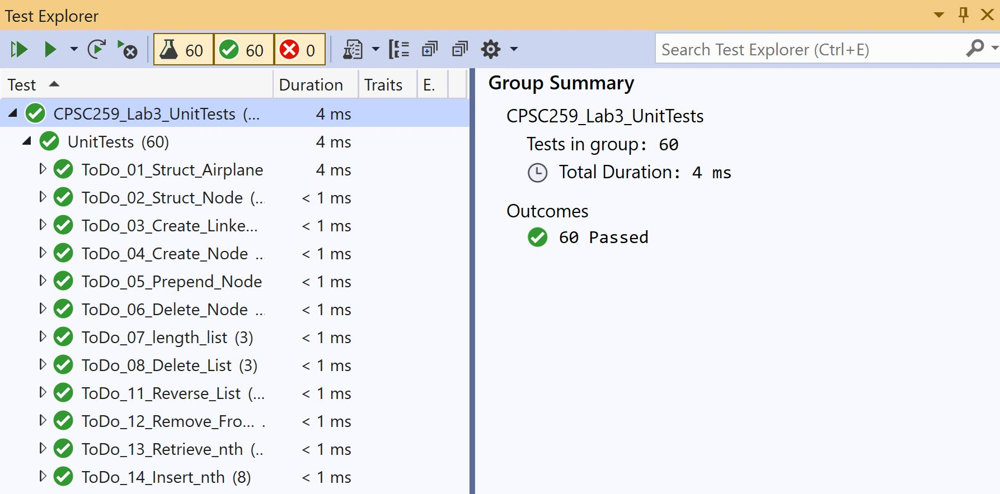

# Airplane Linked List

## Contents

* [Overview](#Overview)
    * [Airplane Structure](#Airplane-Structure)
    * [Linked List](#Linked-List)
    * [Functions](#Functions)
* [Unit Test](#Unit-Test)
	* [VS-2019](#Visual-Studio-2019)

## Overview

This repository contains a **C** program which implements the framework for a linked list of airplane structures.

### Airplane Structure

We have defined an airplane structure in our [(`linkedlist.h`)](CPSC259_Lab3_Framework/linkedlist.h) header file, as shown below :

```c
typedef struct airplane {
	int flight_number;

	char* city_origin;
	char* city_destination;

	int priority;

	int maximum_speed_kph;
	int cruising_altitude;

	int capacity;
} airplane;
```

### Linked List

We have defined a linked list of airplane structures, which causes one airplane to point to another. This is coded in our [(`linkedlist.h`)](CPSC259_Lab3_Framework/linkedlist.h) header file, as shown below :

```c
typedef struct node {
	airplane plane;
	struct node* next;
} node;
```

### Functions

We have defined functions in our [(`linkedlist.c`)](CPSC259_Lab3_Framework/linkedlist.c) source file to provide read and write access to the airplane linked list and its nodes.

The linked list functionality includes :</br>
<ul>
	<li>Creating the linked list.</li>
	<li>Deleting the linked list.</li>
	<li>Reversing the linked list.</li>
	<li>Creating an airplane node.</li>
	<li>Inserting an airplane node to the linked list.</li>
	<li>Removing an airplane node from the linked list.</li>
	<li>Printing the data of an airplane node.</li>
</ul>

## Unit Test

Our `main()` function is left unimplemented. We test the framework through various test cases implemented in the [(`unittest.cpp`)](CPSC259_Lab3_UnitTests/unittest.cpp) file.

We run all tests on the different functions implemented in the [(`linkedlist.c`)](CPSC259_Lab3_Framework/linkedlist.c) source file. The development of these test cases was a time extensive process, in which edge case coverage was prioritized.

We have defined the following airplane structures in our **C++** file for use in our test methods: </br>

```c
#define VANCOUVER_TO_TORONTO_PLANE { 100, "Vancouver", "Toronto", 1, 900, 36000, 350 }

#define TORONTO_TO_HALIFAX_PLANE { 200, "Toronto", "Halifax", 2, 800, 26000, 280 }

#define CALGARY_TO_HALIFAX_PLANE { 300, "Calgary", "Halifax", 2, 800, 26000, 280 }
#define CALGARY_TO_EDMONTON_PLANE { 300, "Calgary", "Edmonton", 3, 700, 30000, 200 }

#define KELOWNA_TO_PRINCE_GEORGE_PLANE { 400, "Kelowna", "Prince George", 4, 600, 20000, 100 }
```

### Visual Studio 2019

We must run our tests in the <b>Test Explorer</b> window of <b>Visual Studio 2019</b>. If all tests run as intended, the <b>Test Explorer</b> generates an output as shown below :

<p align="center">
    
</p>

This requires us to include the **C++** unit tests in a <b>Native Unit Test Project</b>.

We add a <b>Reference</b> from the [(`CPSC259_Lab3_UnitTests`)](CPSC259_Lab3_UnitTests/CPSC259_Lab3_UnitTests.vcxproj) project to the
[(`CPSC259_Lab3_Framework`)](CPSC259_Lab3_Framework/CPSC259_Lab3_Framework.vcxproj) project.

<b>Configuration Properties</b> in the <b>VS Solution Explorer</b> :

<ul>
    <li><b>Configuration Properties->General->Configuration Type</b> :</br> <i>Dynamic Library(.dll)</i></li>
    <li><b>VC++ Directories->General->Include Directories</b> :</br> <i>$(SolutionDir)\CPSC259_Lab3_Framework;$(IncludePath)</i></li>
    <li><b>C/C++->General->Additional Include Directories</b> :</br> <i>$(SolutionDir)\CPSC259_Lab3_Framework;$(VCInstallDir)UnitTest\include;%(AdditionalIncludeDirectories)</i></li>
    <li><b>C/C++->Preprocessor->Preprocessor Definitions</b> :</br> <i>WIN32;_DEBUG;%(PreprocessorDefinitions)</i></li>
    <li><b>C/C++->Precompiled Headers->Precompiled Header</b> :</br> <i>Not Using Precompiled Headers</i></li>
    <li><b>Linker->General->Additional Library Directories</b> :</br> <i>$(SolutionDir)\CPSC259_Lab3_Framework\Debug;$(VCInstallDir)UnitTest\lib;%(AdditionalLibraryDirectories)</i></li>
    <li><b>Linker->Input->Additional Dependencies</b> :</br> <i>linkedlist.obj;%(AdditionalDependencies)</i></li>
</ul>