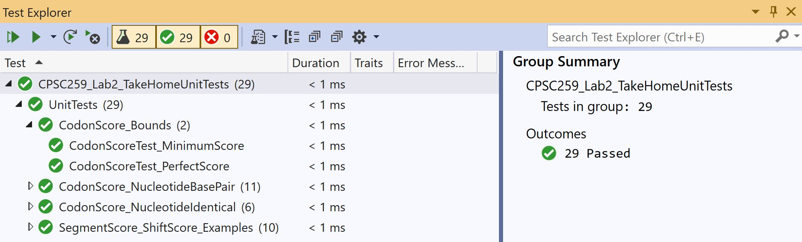

# DNA Scores

## Contents

* [Overview](#Overview)
	* [Text Files](#Text-Files)
	* [Menu](#Menu)
* [Program Actions](#Program-Actions)
	* [Load File](#Load-File)
	* [DNA Scores](#DNA-Scores)
		* [Shift Scores](#Shift-Scores)
		* [Codon Scores](#Codon-Scores)
* [Unit Test](#Unit-Test)
	* [VS-2019](#Visual-Studio-2019)
* [Demonstration](#Demonstration)

## Overview

This repository contains a **C** program which opens a <i>.txt</i> file to analyze a list of DNA sequences, by scoring each of them against a DNA sample sequence. The DNA sample must be at most the same length as the DNA sequence.

### Text Files

The formatted DNA sequence file can be chosen from the following.

* [(`short_sample.txt`)](CPSC259_Lab2_Takehome/short_sample.txt)
* [(`long_sample.txt`)](CPSC259_Lab2_Takehome/long_sample.txt)
* [(`perfect_match.txt`)](CPSC259_Lab2_Takehome/perfect_match.txt)

There are also corresponding results contained in a <i>.txt</i> file of name format <i>x_result.txt</i> where <i>x</i> is the name of the formatted DNA sequence file.

### Menu

The program menu is implemented in the [(`main.c`)](CPSC259_Lab2_Takehome/main.c) source file. An infinite loop in the `int main();` function is used to prompt the user for the next program action.

## Program Actions

The user may choose to : 

<ol>
	<li>Load a <i>.txt</i> file.</li>
	<li>Score DNA sequences in <i>.txt</i> file.</li>
	<li>Exit the <b>C</b> program.</li>
</ol>

The selection is acquired from the standard input terminal.

### Load File

We dynamically allocate memory for the DNA sequences : 

<ul>
	<li><i>char*</i> pointer to reference the sample segment</li>
	<li><i>char**</i> pointer to reference multiple candidate segments</li>
</ul>

The file is iterated to copy the contents to the respective memory location. This is done through extensive memory reallocation in the  `int extract_dna(...);` function, which is implemented in the [(`dna.c`)](CPSC259_Lab2_Takehome/dna.c) source file.

We must deallocate this memory and dereference the pointers when the user wishes to open a new <i>.txt</i> file.

### DNA Scores

We iterate through the candidates and score each of them against the sample sequence, unless a perfect match is found.

The best DNA scores for the candidate sequences are printed to the standard output terminal.

#### Shift Scores

We only consider the best DNA score for each candidate sequence. This is done through shifting the candidate sequence `char*` pointer leftwards by a codon length. We calculate the shift score by comparing the effective candidate sequence against the sample.

Given : 

<ul>
	<li>Sample Sequence : "AAAGGG" </li>
	<li>Candidate Sequence : "CTCAAAGGGTAT" </li>
</ul>

We Calculate Shift Scores For: 

<ol>
	<li>Effective Candidate Sequence: <i>"CTCAAAGGGTAT"</i></li>
	<li>Effective Candidate Sequence : <i>"AAAGGGTAT"</i></li>
	<li>Effective Candidate Sequence : <i>"GGGTAT"</i></li>
</ol>

Shift scores are calculated until the effective candidate sequence contains the same number of codons as the sample sequence.

#### Codon Scores

Codons are sequences composed of 3 nucleotides, such as <i>"CGG"</i>, <i>"ATT"</i>, <i>"GGC"</i>.

The basis of our scoring algorithm is the analysis of codons. Since codons are used to represent amino acids, score points are awarded for certain characteristics.

These include: 
<ul>
	<li>Base Pair Nucleotides : 1 Point</li>
	<li>Identical Nucleotides : 2 Points</li>
	<li>Same Amino Acids : 5 Points</li>
	<li>Identical Codons : 10 Points</li>
</ul>

The sum of the codon scores is equal to the DNA score for the effective candidate sequence. This is what we have defined as a shift score.

## Unit Test

We also test the scoring functionalities through various test cases implemented in the [(`unittest.cpp`)](CPSC259_Lab2_UnitTests/unittest.cpp) file.

We run all tests on the different functions implemented in the [(`dna.c`)](CPSC259_Lab2_Framework/dna.c) source file. The development of these test cases was a time extensive process, in which edge case coverage was prioritized.

In our **C++** file test methods, we compare the calculated DNA scores with the actual scores from the <i>.txt</i> files with the following statement:  
`Assert::AreEqual(actual_score, calculated_score);`

### Visual Studio 2019

We must run our tests in the <b>Test Explorer</b> window of <b>Visual Studio 2019</b>. If all tests run as intended, the <b>Test Explorer</b> generates an output as shown below :

    

This requires us to include the **C++** unit tests in a <b>Native Unit Test Project</b>.

We added a <b>Reference</b> from the [(`CPSC259_Lab2_UnitTests`)](CPSC259_Lab2_UnitTests/CPSC259_Lab2_UnitTests.vcxproj) project to the
[(`CPSC259_Lab2_TakeHome`)](CPSC259_Lab2_TakeHome/CPSC259_Lab2_TakeHome.vcxproj) project.

<b>Configuration Properties</b> in the <b>VS Solution Explorer</b> :

<ul>
    <li><b>Configuration Properties->General->Configuration Type</b> :  <i>Dynamic Library(.dll)</i></li>
    <li><b>VC++ Directories->General->Include Directories</b> :  <i>$(SolutionDir)\CPSC259_Lab2_Takehome;$(IncludePath)</i></li>
    <li><b>C/C++->General->Additional Include Directories</b> :  <i>$(SolutionDir)\CPSC259_Lab2_Takehome;$(VCInstallDir)UnitTest\include;%(AdditionalIncludeDirectories)</i></li>
    <li><b>C/C++->Preprocessor->Preprocessor Definitions</b> :  <i>WIN32;_DEBUG;%(PreprocessorDefinitions)</i></li>
    <li><b>C/C++->Precompiled Headers->Precompiled Header</b> :  <i>Not Using Precompiled Headers</i></li>
    <li><b>Linker->General->Additional Library Directories</b> :  <i>$(SolutionDir)\CPSC259_Lab3_Takehome\Debug;$(VCInstallDir)UnitTest\lib;%(AdditionalLibraryDirectories)</i></li>
    <li><b>Linker->Input->Additional Dependencies</b> :  <i>dna.obj;%(AdditionalDependencies)</i></li>
</ul>

### Demonstration

A video in the [`Demonstrations`](Demonstrations) directory shows the <b>Power Method</b> calculation when running the program on <b>Visual Studio</b>. I have embedded a low resolution compressed version below.

https://user-images.githubusercontent.com/52113009/135697887-fd3978af-ad3b-4cd2-8e92-4ff7584d32d3.mp4

