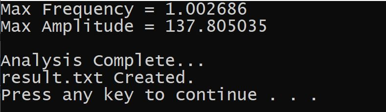

# Fourier Analysis

* [Overview](#Overview)
    * [Fourier Transform](#Fourier-Transform)
* [Text Files](#Text-Files)
    * [Copy Data](#Copy-Data)
    * [Frequency Calculations](#Frequency-Calculations)
* [Demonstration](#Demonstration)

## Overview

This repository contains a **C** program which opens a <i>.txt</i> file to perform the fast discrete fourier transformation of the data readings. The result is then printed to the standard output terminal and written to another <i>.txt</i> file.

## Fourier Transform

The forward fast fourier transform (i.e. fft) is calculated in the [(`discrete_fourier_transform.c`)](CPSC259_Lab1_TakeHome-vs2019/discrete_fourier_transform.c). The `void fft(short int dir, long m, double x[], double y[]);` function is sourced from the following web post on <a href = "http://paulbourke.net/miscellaneous/dft/">Discrete and Fast Fourier Transforms</a>.

For the most part, this is a black box implementation. We just need to specify parameters for the direction, references to arrays to assign the real components and the complex components of the fft, as well as the log2 of the number of data points. The documentation in the [(`discrete_fourier_transform.c`)](CPSC259_Lab1_TakeHome-vs2019/discrete_fourier_transform.c) source file provides further detail.

## Text Files

The data readings are passed into the intended array by processing the [(`puddlejump.txt`)](CPSC259_Lab1_TakeHome-vs2019/puddlejump.txt) file.

The tidal frequency results are written to the [(`result.txt`)](CPSC259_Lab1_TakeHome-vs2019/result.txt) file.

### Copy Data

The [(`puddlejump.txt`)](CPSC259_Lab1_TakeHome-vs2019/puddlejump.txt) file is iterated to extract between *1* and *5* values from each line in the  `void process_file(double array_to_populate[], FILE* pointer_to_data_file);` function. This is used to copy the data readings to the intended array in the [(`discrete_fourier_transform.c`)](CPSC259_Lab1_TakeHome-vs2019/discrete_fourier_transform.c) source file.

### Frequency Calculations

The maximum tidal frequency and amplitude are iteratively calculated and printed to both the standard output terminal and [(`result.txt`)](CPSC259_Lab1_TakeHome-vs2019/result.txt) file in the `void analyze_fft(...);` function.

## Demonstration

Here is a sample of the output in the <b>Visual Studio 2019 IDE</b> when running the fourier analysis program.

    

