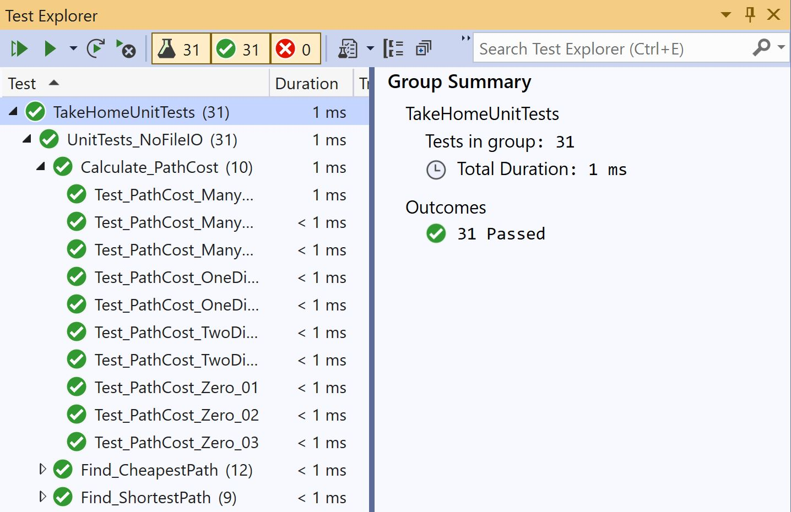
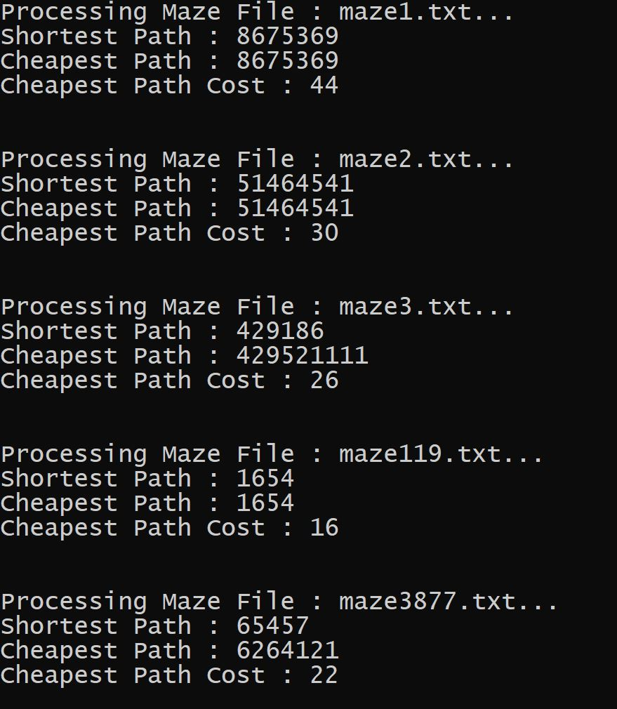

# Maze Solver

* [Overview](#Overview)
    * [Maze Cell](#Maze-Cell)
* [Text Files](#Text-Files)
    * [Load File](#Load-File)
* [Recursion](#Recursion)
	* [Backtracking](#Backtracking)
	* [Generated Paths](#Generated-Paths)
        * [Shortest](#Shortest)
        * [Cheapest](#Cheapest)
* [Unit Tests](#Unit-Tests)
	* [VS-2019](#Visual-Studio-2019)
* [Demonstration](#Demonstration)

## Overview

This repository contains a **C** program which opens a <i>.txt</i> file to generate the possible paths in a square maze which can be taken to reach the right end.

### Maze Cell

We have defined a maze cell structure in our [(`mazesolver.h`)](CPSC259_Lab4_TakeHomeFramework/mazesolver.h) header file, as shown below :

```c
typedef struct maze_cell {
  char character;
  char visited;
} maze_cell;
```

## Text Files

The maze file can be chosen from the following.

* [(`maze1.txt`)](CPSC259_Lab4_TakehomeFramework/maz1.txt)
* [(`maze2.txt`)](CPSC259_Lab4_TakehomeFramework/maze2.txt)
* [(`maze3.txt`)](CPSC259_Lab4_TakehomeFramework/maze3.txt)
* [(`maze119.txt`)](CPSC259_Lab4_TakehomeFramework/maze119.txt)
* [(`maze3387.txt`)](CPSC259_Lab4_TakehomeFramework/maze3387.txt)

The number at the end of the filename indicates the number of total paths in the maze.

### Load File

We dynamically allocate memory for the maze and the generated paths :</br>

<ul>
	<li><i>maze_cell*</i> pointer to reference the maze</li>
	<li><i>char**</i> pointer to reference multiple generated paths</li>
    <li><i>char*</i> pointer to reference the shortest path</li>
    <li><i>char*</i> pointer to reference the cheapest path</li>
</ul>

The file is iterated to copy the maze contents to the respective memory location. This is done through extensive memory reallocation in the </br>`maze_cell** parse_maze(...);` function, which is implemented in the [(`mazesolver.c`)](CPSC259_Lab4_TakehomeFramework/mazesolver.c) source file.

We must deallocate this memory and dereference the `maze_cell**` pointers when we wish to open a new <i>.txt</i> file.

## Recursion

The maze path calculations are done recursively through the establishment of base cases and iteration through the recursive cases.

### Backtracking

The maze paths are generated with an incremental algorithm where we evaluate the possible directions to move in from a given position. This is done by removing the positions we cannot move to from the list of possibilities.

The constraints we come across include:</br>

<ul>
    <li>Cannot move to previous position.</li>
    <li>Cannot move to positions marked with <b>*</b>.</li>
</ul>

### Generated Paths

In order to find the path which best satisfies a condition, we recursively compare the generated paths to each other.

#### Shortest

We recursively compare the generated paths to one another and keep reference to the shortest path until we have compared all the paths.

This is calculated in the `char* find_shortest(...);` function.

#### Cheapest

We recursively compare the generated paths to one another and keep reference to the cheapest path until we have compared all the paths.

This is calculated in the `char* find_cheapest(...);` and the
`int path_cost(char* path);` functions.

## Unit Tests

We also test the path calculation functions implemented in the (`mazesolver.c`)](CPSC259_Lab4_TakeHomeFramework/mazesolver.c) source file.

This is done through various test cases implemented in the [(`TakeHomeUnitTests.cpp`)](TakeHomeUnitTests/TakeHomeUnitTests.cpp) file. The development of these test cases was a time extensive process, in which edge case coverage was prioritized.

In our **C++** file test methods, we compare the path calculations with the expected values using the following macro: </br>

`Assert::AreEqual(strcmp(message, "Shortest Path : 999\n"),STRINGS_EQUAL);`

### Visual Studio 2019

We must run our tests in the <b>Test Explorer</b> window of <b>Visual Studio 2019</b>. If all tests run as intended, the <b>Test Explorer</b> generates an output as shown below :

<p align="center">
    
</p>

We added a <b>Reference</b> from the [(`TakeHomeUnitTests`)](TakeHomeUnitTests/TakeHomeUnitTests.vcxproj) project to the
[(`CPSC259_Lab4_TakeHomeFramework`)](CPSC259_Lab4_TakeHomeFramework/CPSC259_Lab4_TakeHomeFramework.vcxproj) project.

<b>Configuration Properties</b> in the <b>VS Solution Explorer</b> :

<ul>
    <li><b>Configuration Properties->General->Configuration Type</b> :</br> <i>Dynamic Library(.dll)</i></li>
    <li><b>VC++ Directories->General->Include Directories</b> :</br> <i>$(SolutionDir)\CPSC259_Lab4_TakeHomeFramework;$(IncludePath)</i></li>
    <li><b>C/C++->General->Additional Include Directories</b> :</br> <i>$(VCInstallDir)UnitTest\include;%(AdditionalIncludeDirectories)</i></li>
    <li><b>C/C++->Preprocessor->Preprocessor Definitions</b> :</br> <i>_CRT_SECURE_NO_WARNINGS;WIN32;_DEBUG;%(PreprocessorDefinitions)</i></li>
    <li><b>C/C++->Precompiled Headers->Precompiled Header</b> :</br> <i>Not Using Precompiled Headers</i></li>
    <li><b>Linker->General->Additional Library Directories</b> :</br> <i>$(SolutionDir)\CPSC259_Lab4_TakeHomeFramework\Debug;$(VCInstallDir)UnitTest\lib;%(AdditionalLibraryDirectories)</i></li>
    <li><b>Linker->Input->Additional Dependencies</b> :</br> <i>kernel32.lib;user32.lib;gdi32.lib;winspool.lib;comdlg32.lib;advapi32.lib;shell32.lib;ole32.lib;oleaut32.lib;uuid.lib;odbc32.lib;odbccp32.lib;mazesolver.obj;%(AdditionalDependencies)</i></li>
</ul>

## Demonstration

Here is a sample of the output in the <b>Visual Studio 2019 IDE</b> when running the maze solver program.

<p align="center">
    
</p>
